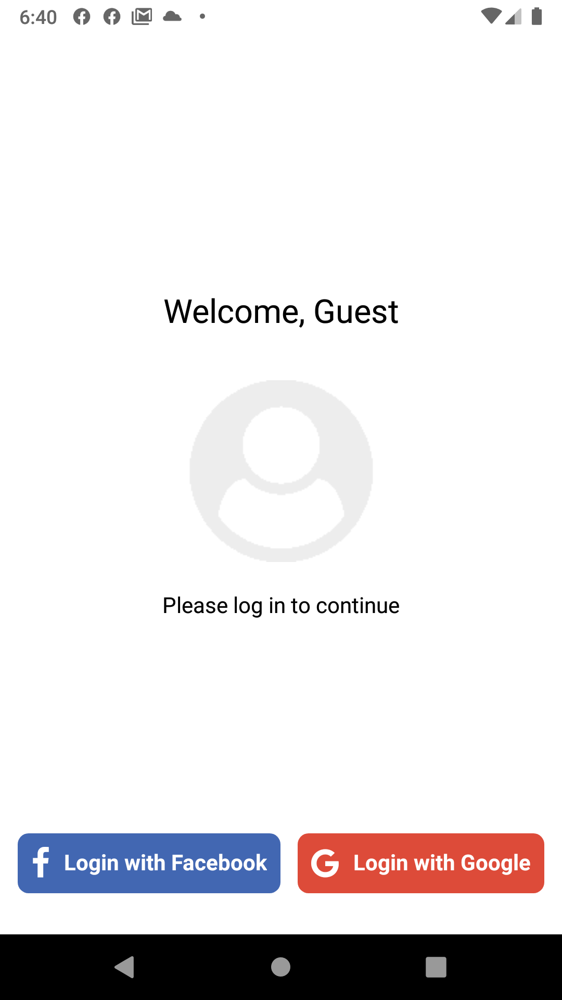
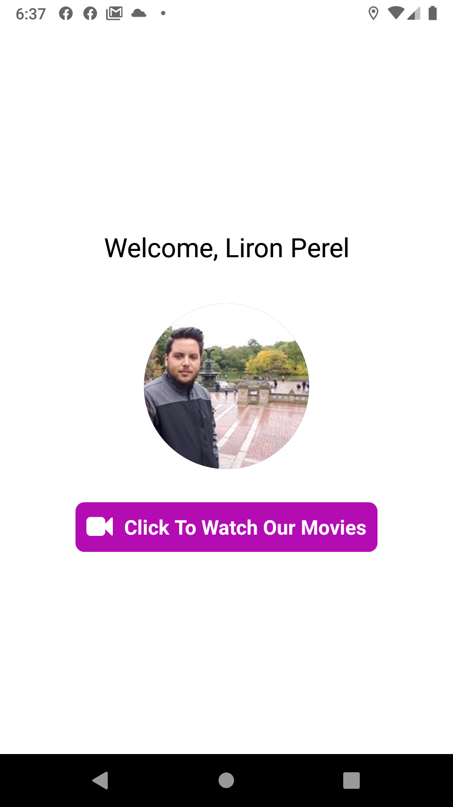
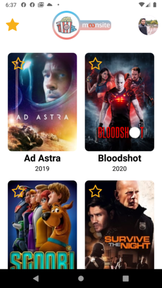
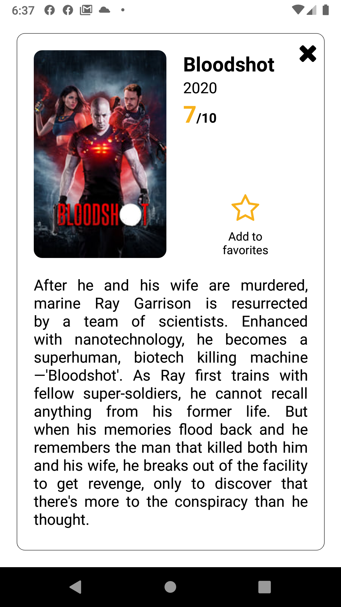
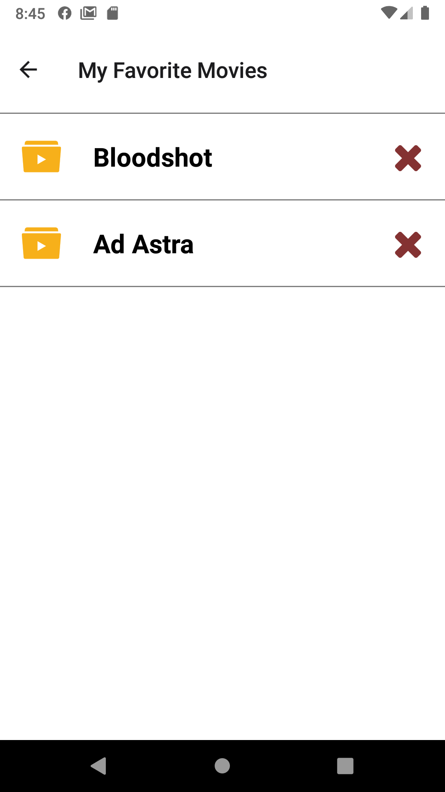

# TMDBMoviesApp
> App showing movies from TMDB API

> React Native & Context API & React Hooks & Functional components







## Main Features
* Login to application using Facebook or Google account
* Main page showing most popular movies from TMDB
* App header shows user profile picture and favorites button
* After clicking a movie a modal pops up and showing:
  * Movie title
  * Year
  * Rating
  * Overview
  * Add/Remove from favorites button
* Each movie can be added to favorites
* Clicking header favorites button opens favorites screen
  On this screen user can view and delete current favorite movies

## Development setup

For login to work properly please setup this application in facebook and google APIs

1. Clone
2. Run `npm install` on main folder.
3. Set .env file on main folder:
```sh
GOOGLE_CID=Google API client id
GOOGLE_CSECRET=Google API client secret
TMDB_KEY=TMDB API key
```
4. Run `react-native run-android`

## Meta

Liron Perel – lironp90@gmail.com

[https://github.com/lironperel/TMDBMoviesApp](https://github.com/lironperel/TMDBMoviesApp)
